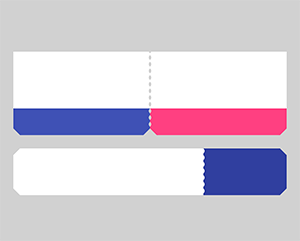

# ShapeOfView

[](https://circleci.com/gh/florent37/ShapeOfView/tree/master)

Give a custom shape to any android view
Useful for Material Design 2

[](https://www.github.com/florent37/ShapeOfView)
[](https://www.github.com/florent37/ShapeOfView)
[](https://www.github.com/florent37/ShapeOfView)

<a href="https://goo.gl/WXW8Dc">
  
</a>

*Breaking change*

the old package `com.github.florent37` has been replaced by `io.github.florent37`

# Download

<a href='https://ko-fi.com/A160LCC' target='_blank'></a>

[  ](https://bintray.com/florent37/maven/shapeofview/)
```java
//using maven central

dependencies {
    implementation 'io.github.florent37:shapeofview:1.4.7'
}
```

# Sample

What you can do with Shape Of View :

[](https://www.github.com/florent37/ShapeOfView)

# Use implemented shapes

ShapeOfView **disable** the `background` property of your view, 
please specify a child with a background to enable it 
```xml
<io.github.florent37.shapeofview.shapes.CircleView
   <FrameLayout
      android:background="@color/blue"
```

ShapeOfView came with pre-created shapes :

## Circle

[](https://www.github.com/florent37/ShapeOfView)

```xml
<io.github.florent37.shapeofview.shapes.CircleView
        android:layout_width="150dp"
        android:layout_height="150dp"

        android:elevation="4dp"
        app:shape_circle_borderColor="@android:color/black"
        app:shape_circle_borderWidth="2dp">

            <!-- YOUR CONTENT -->

</io.github.florent37.shapeofview.shapes.CircleView>
```

## RoundRect

[](https://www.github.com/florent37/ShapeOfView)

```xml
<io.github.florent37.shapeofview.shapes.RoundRectView
        android:layout_width="150dp"
        android:layout_height="100dp"
        android:elevation="4dp"
        app:shape_roundRect_bottomLeftRadius="10dp"
        app:shape_roundRect_bottomRightRadius="10dp"
        app:shape_roundRect_topLeftRadius="10dp"
        app:shape_roundRect_topRightRadius="10dp"
        
        app:shape_roundRect_borderColor="@android:color/black"
        app:shape_roundRect_borderWidth="2dp"
        >


            <!-- YOUR CONTENT -->

</io.github.florent37.shapeofview.shapes.RoundRectView>
```

## ClipCorner

[](https://www.github.com/florent37/ShapeOfView)

```xml
<io.github.florent37.shapeofview.shapes.CutCornerView
        android:id="@+id/clipCorner"
        android:layout_width="150dp"
        android:layout_height="100dp"
        android:elevation="4dp"
        app:shape_cutCorner_bottomRightSize="20dp">

         <!-- YOUR CONTENT -->

</io.github.florent37.shapeofview.shapes.CutCornerView>
```

## Arc

[](https://www.github.com/florent37/ShapeOfView)

```xml
<io.github.florent37.shapeofview.shapes.ArcView
        android:layout_width="150dp"
        android:layout_height="100dp"
        android:elevation="4dp"
        app:shape_arc_cropDirection="outside"
        app:shape_arc_height="20dp"
        app:shape_arc_position="bottom"
        >

         <!-- YOUR CONTENT -->

</io.github.florent37.shapeofview.shapes.ArcView>
```


## Diagonal

[](https://www.github.com/florent37/ShapeOfView)


```xml
<io.github.florent37.shapeofview.shapes.DiagonalView
        android:layout_width="150dp"
        android:layout_height="100dp"
        android:elevation="4dp"
        app:shape_diagonal_angle="10"
        app:shape_diagonal_direction="right" 
        app:shape_diagonal_position="bottom">

         <!-- YOUR CONTENT -->

</io.github.florent37.shapeofview.shapes.DiagonalView>
```

## Triangle

[](https://www.github.com/florent37/ShapeOfView)

```xml
<io.github.florent37.shapeofview.shapes.TriangleView
         android:layout_width="150dp"
         android:layout_height="150dp"
         android:elevation="4dp"

         app:shape_triangle_percentBottom="0.5"
         app:shape_triangle_percentLeft="0"
         app:shape_triangle_percentRight="0">

            <!-- YOUR CONTENT -->

</io.github.florent37.shapeofview.shapes.TriangleView>
```

## Bubble

[](https://www.github.com/florent37/ShapeOfView)

```xml
<io.github.florent37.shapeofview.shapes.BubbleView
        android:layout_width="150dp"
        android:layout_height="150dp"
        app:shape_bubble_arrowHeight="10dp"
        app:shape_bubble_arrowWidth="10dp"
        app:shape_bubble_arrowPosition="bottom"
        app:shape_bubble_borderRadius="20dp"
        app:arrow_posititon_percent="0.5"
        >

         <!-- YOUR CONTENT -->

</io.github.florent37.shapeofview.shapes.BubbleView>
```

## Star

[](https://www.github.com/florent37/ShapeOfView)
[](https://www.github.com/florent37/ShapeOfView)

```xml
<io.github.florent37.shapeofview.shapes.StarView
        android:layout_width="150dp"
        android:layout_height="150dp"
        app:shape_star_noOfPoints="5">

         <!-- YOUR CONTENT -->

</io.github.florent37.shapeofview.shapes.StarView>
```

## Polygon

[](https://www.github.com/florent37/ShapeOfView)

```xml
 <io.github.florent37.shapeofview.shapes.PolygonView
            android:layout_width="150dp"
            android:layout_height="100dp"
            app:shape_polygon_noOfSides="9"
            >
         <!-- YOUR CONTENT -->

</io.github.florent37.shapeofview.shapes.PolygonView>
```

## Dotted Edges with Cut Corners

[](https://www.github.com/florent37/ShapeOfView)

```xml
 <io.github.florent37.shapeofview.shapes.DottedEdgesCutCornerView
             android:layout_width="100dp"
             android:layout_height="match_parent"
             app:shape_dot_radius="3dp"
             app:shape_dot_spacing="2dp"
             app:shape_edge_position="right|left"
             app:shape_dottedEdgesCutCorner_bottomLeftSize="8dp"
             app:shape_dottedEdgesCutCorner_bottomRightSize="8dp"
             >

             <!-- YOUR CONTENT -->

 </io.github.florent37.shapeofview.shapes.DottedEdgesCutCornerView>
```

## Animation

All shapes methods can be animated

For example, you can animate a RoundRect corner :

[](https://www.github.com/florent37/ShapeOfView)

```kotlin
ValueAnimator.ofFloat(0f, 200f, 0f).apply {
     addUpdateListener { animation -> roundRect.bottomLeftRadius = (animation.animatedValue as Float).toInt() }
     duration = 800
     repeatCount = ValueAnimator.INFINITE
     repeatMode = ValueAnimator.REVERSE
}.start()
```

# Create you own shape

You can use custom shape to cut your view

# Using Drawable (no elevation)

[](https://www.github.com/florent37/ShapeOfView)

```xml
<io.github.florent37.shapeofview.ShapeOfView
        android:layout_width="100dp"
        android:layout_height="100dp"

        app:shape_clip_drawable="@drawable/YOUR_DRAWABLE"
        >

    <!-- YOUR CONTENT -->

 </io.github.florent37.shapeofview.ShapeOfView>
```

# Using Path (with elevation)

This method generates also a **shadow path** (with Lollipop elevation API 21+)

Wrap your view with a `ShapeOfView`

```xml
<io.github.florent37.shapeofview.ShapeOfView
        android:id="@+id/myShape"
        android:layout_width="30dp"
        android:layout_height="15dp"
        android:elevation="6dp">

        <!-- YOUR CONTENT -->

 </io.github.florent37.shapeofview.ShapeOfView>
```

Then generate a path in your code :

```java
ShapeOfView shapeOfView = findViewById(R.id.myShape)
shapeOfView.setClipPathCreator(new ClipPathManager.ClipPathCreator() {
       @Override
       public Path createClipPath(int width, int height) {
           final Path path = new Path();

            //eg: triangle
           path.moveTo(0, 0);
           path.lineTo(0.5 * width, height);
           path.lineTo(width, 0);
           path.close();

           return path;
       }
});
```

In some case you have to specify `requiresBitmap = true` to enable ShapeOfView to draw the shape inside a bitmap before clipping your view. It will be less efficient but can make your custom shape work.

# Contribute

Feel free to fork this project, and add customs shapes

Then make a `merge-request` after updated the README with a sample of your shape, including a preview

# TODO

# HISTORY

**1.4.5** Removed DiagonalView's Direction : if diagonalAngle > 0 ? DIRECTION_LEFT : DIRECTION_RIGHT

**1.4.5** Removed ArcView's ArcDirection : CROP_OUTSIDE if arcHeight > 0, CROP_INSIDE if arcHeight < 0

**1.4.1** Added Dotted Edge, thanks to @khunzohn

**1.4.0** Support AndroidX

**1.3.2** Backport of 1.3.0 for api 14+

**1.3.0** Fixed rendering on android API 28+

**1.2.0** Removed bitmap usage in a lot of usecases (diagonal, arc, roundrect, circle)

**1.1.0** Disabled setBackground on ShapeOfView

**1.0.9** Added requiresShapeUpdate(), allowing animations to work, look at AnimationActivity

**1.0.8** Used arcTo instead of quads in RoundRect, added border to RoundRect

**1.0.7** Prefixed all attributes by `shape_`

**1.0.6** Updated roundrect implementation

**1.0.5** Enable hardware acceleration after clip view

**1.0.4** Added PolygonView

**1.0.2** Added StarView

**1.0.1** Added BubbleView

# Credits

Ed Sheeran, for the name of this project and his awesome songs <3

Author: Florent Champigny 

Blog : [http://www.tutos-android-france.com/](http://www.tutos-android-france.com/)

Fiches Plateau Moto : [https://www.fiches-plateau-moto.fr/](https://www.fiches-plateau-moto.fr/)

<a href="https://goo.gl/WXW8Dc">
  
</a>

<a href="https://plus.google.com/+florentchampigny">
  
</a>
<a href="https://twitter.com/florent_champ">
  
</a>
<a href="https://www.linkedin.com/in/florentchampigny">
  
</a>


License
--------

    Copyright 2017 Florent37, Inc.

    Licensed under the Apache License, Version 2.0 (the "License");
    you may not use this file except in compliance with the License.
    You may obtain a copy of the License at

       http://www.apache.org/licenses/LICENSE-2.0

    Unless required by applicable law or agreed to in writing, software
    distributed under the License is distributed on an "AS IS" BASIS,
    WITHOUT WARRANTIES OR CONDITIONS OF ANY KIND, either express or implied.
    See the License for the specific language governing permissions and
    limitations under the License.
